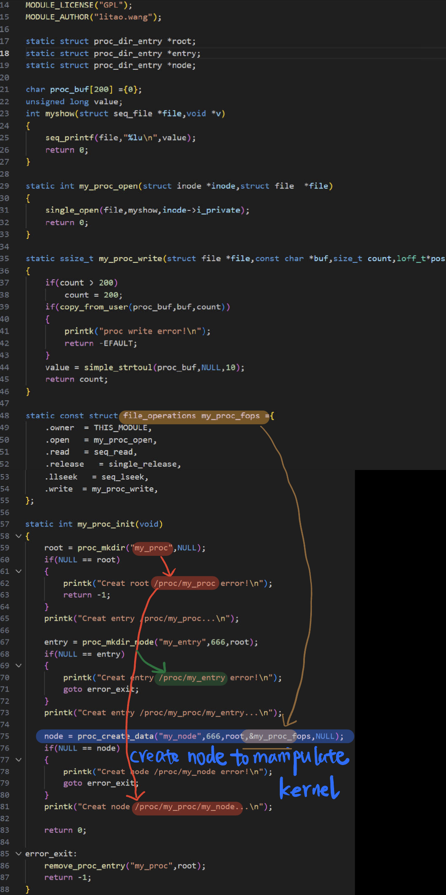
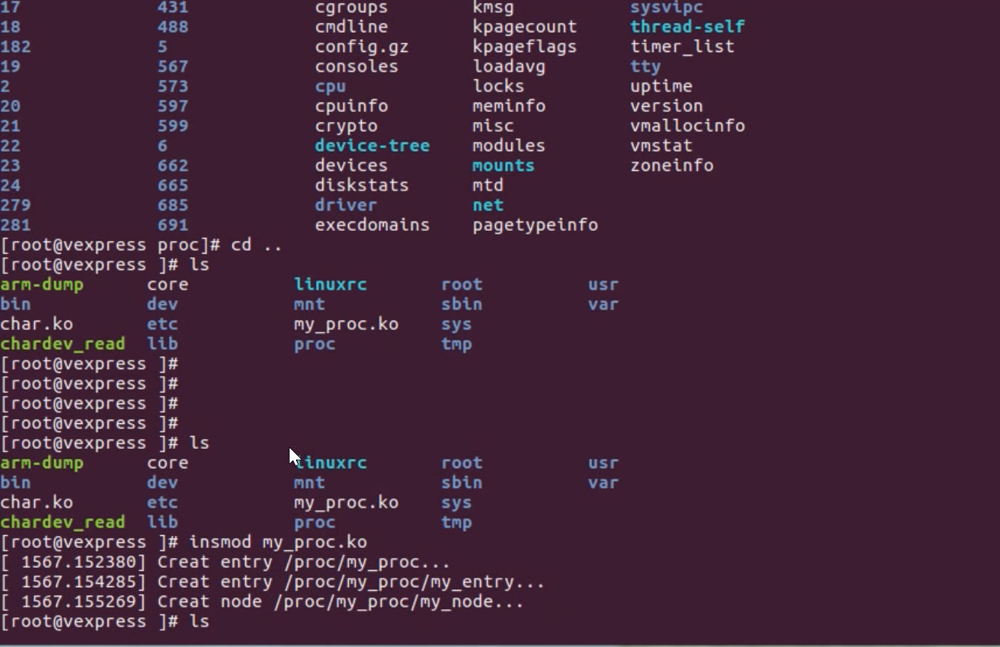

# Use the proc file system to interact with the kernel


## proc file system

1. Virtual file system, communicated between kernel and user space

2. Proc content is dynamically created and disappears after power off
3. Many modules are available through proc inode to communicate, interact with userspace

## View process information

| • /proc/pid/cmdline | Contains the command to start the process                    |
| ------------------- | ------------------------------------------------------------ |
| • /proc/pid/cwd     | Contains a link to the working directory of the current process |
| • /proc/pid/environ | Contains a list of available process environment variables   |
| • /proc/pid/exe     | Contains links to programs running in the process            |
| • /proc/pid/fd/     | This directory contains links to files opened by the process |
| • /proc/pid/mem     | Contains the contents of the process in memory               |
| • /proc/pid/stat    | Contains the status information of the process               |
| • /proc/pid/statm   | Contains memory usage information for the process            |

## View kernel information through proc

• Memory management

• File system

device driver

• system bus

• Power management

Terminal

System Control Configuration 

Network


## Proc Interface Function

```
struct proc_dir_entry {
• umode_t mode;
• const struct inode_operations *proc_iops;//inode操作
• const struct file_operations *proc_fops;//文件操作
• struct proc_dir_entry *next, *parent, *subdir;
• read_proc_t *read_proc;
• write_proc_t *write_proc;
• atomic_t count;
• int pde_users;
• struct completion *pde_unload_completion;
• struct list_head pde_openers;
• spinlock_t pde_unload_lock;
• u8 namelen;
• char name[];
• }; 
```

## Proc API (which included in /usr/include/linux/proc_fs.h\ )

• 一些API接口

```
• struct proc_dir_entry *proc_mkdir(const char *, struct
proc_dir_entry *);
• void remove_proc_entry(const char *, struct proc_dir_entry *);
• struct proc_dir_entry *proc_create_data(const char *,
umode_t,struct proc_dir_entry *,const struct file_operations
*,void *);
```

Practical 10



Manipulate successful! Create three node to manipulate Kernel

